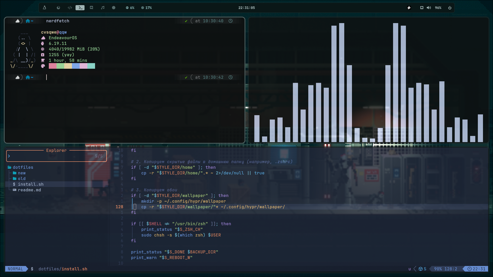

# MD4H — My Dotfiles for Hyprland

  

---

> ⚠️ **ВНИМАНИЕ**  
> Я не несу ответственности за вашу систему.  
> Скрипт автоматически создаст бэкап ваших настроек в папку `~/.dotfiles_backup_[дата]`, но всегда лучше иметь ручную копию важных данных.

---

## 📌 Особенности

- ⚙️ **Автоматизация**  
  Установка всех зависимостей (включая AUR-помощник и драйверы NVIDIA)

- 🔒 **Безопасность**  
  Автоматическое резервное копирование существующих конфигов

- 🧩 **Удобство**  
  Автоматическая настройка ZSH и шрифтов

---

## 🚀 Установка

Для быстрой установки выполните:

    git clone https://github.com/cvsqwe/MD4H-My-Dotfiles-For-Hyprland- ~/MD4H
    cd ~/MD4H
    chmod +x install.sh
    ./install.sh

---

## 📦 Что будет установлено

- 🪟 WM: **Hyprland**
- 🖥️ Terminal: **Kitty**
- 🐚 Shell: **ZSH** (+ Oh-My-Zsh)
- 📊 Bar: **Waybar**
- 📋 Menu: **Rofi**
- 🔔 Notifications: **Mako**
- 🖼️ Wallpaper: **SWWW**
- ✏️ Editor: **Neovim**
- 📁 File Manager: **Thunar**
- 🔤 Fonts: **JetBrainsMono Nerd Font** & **Roboto Mono**

---

## ⌨️ Кейбинды

| Комбинация | Действие |
|----------|--------|
| SUPER + Q | Закрыть программу |
| SUPER + D | Меню приложений |
| SUPER + W | Плавающее окно |
| SUPER + Return | Терминал |
| SUPER + E | Файловый менеджер |
| SUPER + B | Браузер |
| SUPER + V | История буфера обмена |
| SUPER + SHIFT + P | Меню питания |
| SUPER + SHIFT + S | Скриншот области |
| SUPER + ← → ↑ ↓ | Смена фокуса |
| SUPER + 1..0 | Смена рабочего стола |
| SUPER + SHIFT + 1..0 | Переместить окно на рабочий стол |

---

## 🛠️ Планы

- (будет добавлено позже)

---

# 🇬🇧 English Version

## MD4H — My Dotfiles for Hyprland

  

---

> ⚠️ **WARNING**  
> I am not responsible for your system.  
> The script will automatically create a backup of your configs in `~/.dotfiles_backup_[date]`, but it's always recommended to manually back up important data.

---

## 📌 Features

- ⚙️ **Automation**  
  Installs all dependencies (including AUR helper and NVIDIA drivers)

- 🔒 **Safety**  
  Automatically backs up existing configurations

- 🧩 **Convenience**  
  Auto-configures ZSH and fonts

---

## 🚀 Installation

Run the following command:

    git clone https://github.com/cvsqwe/MD4H-My-Dotfiles-For-Hyprland- ~/MD4H
    cd ~/MD4H
    chmod +x install.sh
    ./install.sh

---

## 📦 What Gets Installed

- 🪟 WM: **Hyprland**
- 🖥️ Terminal: **Kitty**
- 🐚 Shell: **ZSH** (+ Oh-My-Zsh)
- 📊 Bar: **Waybar**
- 📋 Menu: **Rofi**
- 🔔 Notifications: **Mako**
- 🖼️ Wallpaper: **SWWW**
- ✏️ Editor: **Neovim**
- 📁 File Manager: **Thunar**
- 🔤 Fonts: **JetBrainsMono Nerd Font** & **Roboto Mono**

---

## ⌨️ Keybindings

| Key | Action |
|-----|--------|
| SUPER + Q | Close window |
| SUPER + D | App launcher |
| SUPER + W | Toggle floating |
| SUPER + Enter | Terminal |
| SUPER + E | File manager |
| SUPER + B | Browser |
| SUPER + V | Clipboard history |
| SUPER + SHIFT + P | Power menu |
| SUPER + SHIFT + S | Area screenshot |
| SUPER + Arrows | Change focus |
| SUPER + 1..0 | Switch workspace |
| SUPER + SHIFT + 1..0 | Move window to workspace |

---

## 🛠️ Roadmap

- (coming soon)
